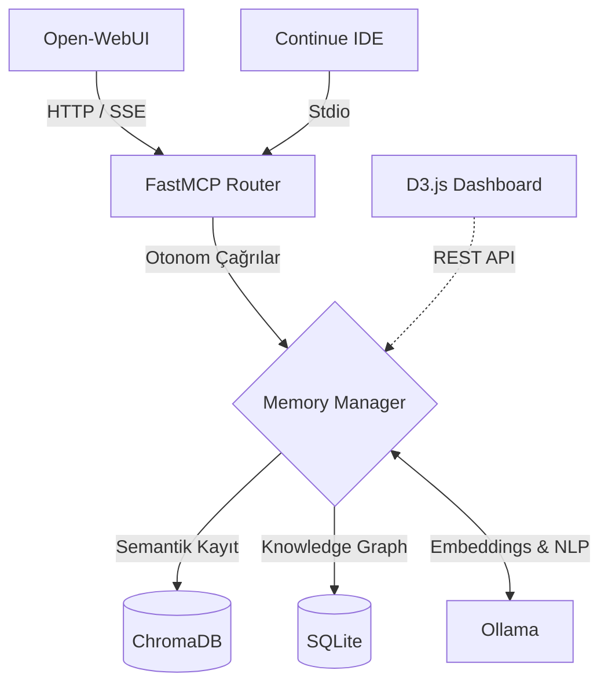

<div align="center">

```text
  _                     _           _           _ 
 | |                   | |         (_)         | |
 | |     ___   ___ __ _| |_ __ ___  _ _ __   __| |
 | |    / _ \ / __/ _` | | '_ ` _ \| | '_ \ / _` |
 | |___| (_) | (_| (_| | | | | | | | | | | | (_| |
 \_____/\___/ \___\__,_|_|_| |_| |_|_|_| |_|\__,_|
```

**Sovereign Digital Memory & Knowledge Graph for Local LLMs**

[](https://github.com/jlowin/fastmcp)
[](https://www.python.org/)
[](https://nixos.org/)
[](#lisans)

</div>

Localmind, yazdığınız notları sadece depolayan aptal bir veritabanı değildir. Arka planda **Ollama** ile çalışan, bilgileri anlayan, birbiriyle ilişkilendiren ve ihtiyaç anında bağlamıyla birlikte doğrudan yapay zeka modelinize (LLM) sunan **durumsuz (stateless) bir Zihin Sarayıdır.**

Hiçbir veri internete çıkmaz. Bulut yok, abonelik yok. Tamamen yerel, tamamen sizin.

---

## 🚀 Temel Felsefe & Özellikler

* **Veri Egemenliği (Sovereignty):** Sistem tamamen kapalı devredir. Tüm verileriniz makinenizde, sizin kontrolünüz altındadır.
* **Semantik Vektör Arama (ChromaDB):** Geleneksel regex veya kelime eşleşmesi yerine, cümlenin "anlamını" arar. 
* **Otonom Knowledge Graph (SQLite):** Eklenen her bilgi parçacığından `Kişi`, `Kavram`, `Teknoloji` gibi varlıkları (Entity) ve aralarındaki ilişkileri otomatik olarak çıkarır.
* **Ebbinghaus Unutma Eğrisi:** Sisteme entegre edilen zaman aşımı skoru sayesinde, uzun süre erişilmeyen önemsiz bilgiler zamanla geriye düşerken, sık erişilen kritik notlar her zaman canlı kalır.
* **Otomatik Sınıflandırma:** Notlarınız arka planda analiz edilerek en uygun odalara (`mimari`, `güvenlik`, `donanım`, `kişisel` vb.) otomatik yerleştirilir.

---

## 🧠 MCP Araçları (Tools)

Localmind, FastMCP mimarisi üzerinden LLM'inize şu otonom yetenekleri kazandırır:

| Araç Adı | Açıklama |
| :--- | :--- |
| `hafizaya_yaz` | Bilgiyi akıllıca kaydeder, varlık çıkarımı yapar ve sınıflandırır. |
| `hafizada_ara` | Zihin sarayında semantik benzerliğe göre arama yapar. |
| `grafik_sorgula` | Bir kavramın veya kişinin Knowledge Graph üzerindeki bağlantı ağını çizer. |
| `oturum_ozetle` | Uzun sohbetleri analiz edip yapılandırılmış kalıcı anılara dönüştürür. |
| `hatirlat` | Uzun süredir bakılmayan ama "önemli" olarak işaretlenmiş anıları proaktif olarak hatırlatır. |
| `gecmise_bak` | Son N gün içinde öğrenilen veya kaydedilen tüm bilgileri listeler. |
| `profil_goster` | Hangi konularda daha çok düşündüğünüzü (oda ve etiket dağılımı) analiz eder. |

---

## 🏗️ Mimari Topoloji

Localmind, **Temmuz 2026** standartlarına uygun Stateless FastMCP mimarisi üzerine inşa edilmiştir.



---

## ⚙️ Kurulum & Çalıştırma

Proje temel olarak standart bir Python uygulamasıdır. Sisteminizde **Ollama**'nın çalışıyor olduğundan emin olun.

### 1. Ortam Hazırlığı
```bash
git clone https://codeberg.org/xmrah/localmind.git
cd localmind

python -m venv .venv
source .venv/bin/activate
pip install -r requirements.txt
```
*(NixOS kullanıcıları doğrudan `nix develop` ile izole ortama girebilirler.)*

### 2. İstemciye Göre Sunucuyu Başlatma
Localmind, kullanacağınız arayüze göre farklı transport katmanları sunar:

- **Open-WebUI için (HTTP MCP):**
  ```bash
  ./run_mcp_sse.sh
  ```
- **Continue / VSCodium için (Stdio MCP):**
  ```bash
  ./run_mcp.sh
  ```
- **D3.js Dashboard Arayüzü için:**
  ```bash
  python server_sse.py
  ```

---

## 🔌 İstemci Entegrasyonları

### Open-WebUI
Yönetici paneli > Dış Araçlar (Bağlantılar) sekmesine gidin ve bağlantıyı şöyle yapılandırın:
- **Tür:** `MCP` (veya MCP Streamable HTTP)
- **URL:** `http://127.0.0.1:8001/mcp`
- **ID:** `localmind`
*(Yetki/Auth kısmını `Yok` veya boş bırakın, sistem tamamen yereldir.)*

### Continue
`~/.continue/config.json` dosyanıza şu bloğu ekleyin:
```json
{
  "mcpServers": [
    {
      "name": "localmind",
      "command": "bash",
      "args": ["/home/xmrah/Projects/localmind/run_mcp.sh"]
    }
  ]
}
```

---

## 🛡️ Sovereign Geliştirici Notu

Bu sistem, verinin bulut şirketlerinin elinde oyuncak olmasına karşı bir duruştur. `core/memory_manager.py` içindeki tüm veritabanı I/O işlemleri `asyncio.to_thread` ile asenkronize edilmiş olup, yapay zeka modelinizin saniyede binlerce token üretirken bile arayüzü kilitlememesi sağlanmıştır. 

Kod yapısı olabildiğince şeffaf ve sadedir. Fork'layın, parçalayın, kendi zihin sarayınızı inşa edin.

## Lisans
MIT License.
