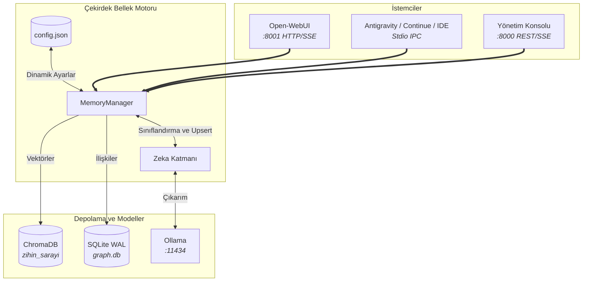

<div align="center">

# Localmind

### Sovereign Digital Memory & Knowledge Graph for Local LLMs
*Yapay Zeka Ajanları ve Kullanıcı Egemenliği İçin Yerel ve Çevrimdışı Zihin Sarayı*

[](https://github.com/jlowin/fastmcp)
[](https://www.python.org/)
[](https://nixos.org/)
[](https://codeberg.org/xmrah/localmind/wiki)
[](#lisans)

</div>

Localmind, notları yalnızca depolayan pasif bir veritabanı değildir. Arka planda yerel Ollama modelleriyle çalışan, bilgileri anlayan, anlamsal ilişkiler ve varlık ağını çıkaran, Zihin Sarayı hiyerarşisiyle düzenleyen ve ihtiyaç anında bağlamıyla birlikte doğrudan yapay zeka modeline veya web konsoluna sunan durumsuz ve egemen bir bellek sistemidir.

Veriler internete veya bulut sunucularına iletilmez. API anahtarı, telemetri veya abonelik gerektirmez. Tamamen yerel çalışır ve harici bağımlılık içermez.

---

## Hızlı Kurulum

### 1. Depoyu Klonlama ve Başlatma

```bash
git clone https://codeberg.org/xmrah/localmind.git
cd localmind

python3 -m venv .venv
source .venv/bin/activate
pip install -r requirements.txt

python server_sse.py
```

Web yönetim paneli `http://127.0.0.1:8000` adresinde hazır hale gelir.

NixOS kullanıcıları doğrudan `nix develop` ile geliştirme kabuğuna geçebilir veya flake üzerinden çalıştırabilir.

### 2. Ollama Modeli

Yerel anlamsal analiz ve varlık çıkarımı için sistemde Ollama bulunması önerilir:

```bash
ollama serve
ollama pull qwen2.5-coder:7b
```

Ollama çalışmadığında sistem 0 MB VRAM Hızlı Mod ile anında ve doğrudan manuel kayıt almaya devam eder.

---

## Temel Yetenekler

* **Veri Egemenliği:** Bellek veritabanı, vektör indeksleri ve grafik ilişkileri yalnızca yerel diskte saklanır.
* **Zihin Sarayı Hiyerarşisi:** Anılar düz bir vektör havuzunda kaybolmaz; Kanat, Oda ve Dolap koordinatlarıyla yapılandırılır.
* **Komut Paleti:** `Ctrl+K` ile klavye üzerinden doğrudan arama, sayfa geçişi ve anı ekleme.
* **Katkı Isı Haritası:** 140 günlük kayıt geçmişini yoğunluk kademeleriyle izleme ve tarihe göre filtreleme.
* **Canlı Bilgi Grafiği:** D3.js ile merkez düğüm titreşimi, bağlantı akış çizgileri ve organik hareket sunan ilişki ağı.
* **Analitik İçgörüleri:** 30 günden eski yüksek öncelikli paslanan anılar, bağlantısız öksüz anılar ve tematik odak dağılımı.
* **Dinamik Yapılandırma:** Kod değiştirmeden `config.json` veya arayüz üzerinden model değiştirme, anlık test ve ayar güncelleme.
* **Yönetim Konsolu:** Geçmişe dönük kayıt, kalıcı silme, arşivleme ve geri alma desteği.
* **Hibrit Semantik Arama:** Cosine vektör benzerliği, SQLite BM25 anahtar kelime eşleşmesi ve Ebbinghaus çürüme puanı birleşimi.
* **Ebbinghaus Bellek Çürümesi:** Zaman içinde az erişilen kayıtları arka plana alan, sık kullanılan ve önemli anıları önde tutan matematiksel model.

---

## Zihin Sarayı Hiyerarşisi

Localmind, antik Loci Yöntemi'ni ChromaDB metadata filtreleme şemasına entegre eder:

```text
Zihin Sarayı
 └── Kanat     → En üst bağlam veya proje (örn: NixOS, Ağ Güvenliği, Frontend)
      └── Oda     → Tematik kategori (örn: mimari, guvenlik, donanim, ogrenme)
           └── Dolap → Özel konu başlığı veya bileşen (örn: Flake, FastMCP, Hyprland)
                └── Anı   → Doğrudan not, karar metni veya bilgi
```

* **Cerrahi Filtreleme:** Binlerce kayıt taranmadan doğrudan hedeflenen kanat veya dolap içinde sorgulama yapılır.
* **Geriye Dönük Uyumluluk:** Kanat veya dolap belirtilmeyen kayıtlar varsayılan olarak genel alanına atanır.

---

## Mimari Topoloji


```mermaid
flowchart TD
    subgraph Clients ["İstemciler"]
        direction LR
        C1["Open-WebUI<br><i>:8001 HTTP/SSE</i>"]
        C2["Antigravity / Continue / IDE<br><i>Stdio IPC</i>"]
        C3["Yönetim Konsolu<br><i>:8000 REST/SSE</i>"]
    end

    subgraph Core ["Çekirdek Bellek Motoru"]
        CFG[("config.json")] <-->|Dinamik Ayarlar| MM["MemoryManager"]
        MM <-->|Sınıflandırma ve Upsert| INT["Zeka Katmanı"]
    end

    subgraph Storage ["Depolama ve Modeller"]
        direction LR
        VDB[("ChromaDB<br><i>zihin_sarayi</i>")]
        GDB[("SQLite WAL<br><i>graph.db</i>")]
        OLLAMA["Ollama<br><i>:11434</i>"]
    end

    C1 ==> MM
    C2 ==> MM
    C3 ==> MM

    MM -->|Vektörler| VDB
    MM -->|İlişkiler| GDB
    INT <-->|Çıkarım| OLLAMA
```

---

## Yönetim Konsolu

`http://127.0.0.1:8000` adresindeki web arayüzü aşağıdaki bölümleri içerir:

| Bölüm | Özellikler |
| :--- | :--- |
| **Genel Bakış** | Canlı sistem göstergesi, sayaç animasyonları, hızlı anı girişi ve son hareketler. |
| **Bilgi Grafiği** | D3.js ile varlık ve bellek ağı, merkez düğüm aurası, akış çizgileri ve süzülme hareketi. |
| **Odalar** | Kanat ve dolap sayaçları, tazelik rozetleri ve son anı önizlemesi. |
| **Zaman Çizelgesi** | 140 günlük katkı ısı haritası, gün filtresi ve 90 günlük etkinlik eğrisi. |
| **Analitik** | Paslanan anılar, öksüz anılar, odak ağırlığı, unutma eğrisi ve önem dağılımı. |
| **Hatırlatmalar** | Ebbinghaus eğrisine göre unutulmaya yüz tutmuş kritik bilgilerin listesi. |
| **Arşiv** | Arşivlenen kayıtlar; tek tıkla geri alma veya kalıcı silme. |
| **Ayarlar** | Ollama model listesi, canlı test, unutma katsayısı ve yapılandırma kaydı. |

---

## FastMCP Araçları

Ajanların çağırdığı temel işlevler:

| Araç | Tanım |
| :--- | :--- |
| `hafizaya_yaz` | Kanat, dolap ve önem derecesiyle kayıt alır; yapay zeka kapalıyken 0 MB VRAM ile anında yazar. |
| `hafizada_ara` | Vektör, metin ve unutma faktörünü harmanlayan semantik arama yapar. |
| `hafizayi_unut` | Kaydı silmeden arşive taşır. |
| `grafik_sorgula` | Bir kavram veya varlığın ilişki ağını getirir. |
| `oturum_ozetle` | Konuşma metnini yapılandırılmış anıya dönüştürür. |
| `hatirlat` | Unutulmaya başlayan önemli bilgileri listeler. |
| `gecmise_bak` | Belirtilen tarih aralığındaki kayıtları getirir. |
| `profil_goster` | Kullanıcının oda ve etiket dağılımını özetler. |
| `oda_listele` | Mevcut odaları, alt mekanları ve kayıt sayılarını döndürür. |
| `hafizayi_aktar` | Tüm belleği JSON formatında dışa aktarır. |

---

## İstemci Entegrasyonları

### Antigravity IDE, Claude Desktop ve Continue
`mcp_config.json` dosyasında:
```json
{
  "mcpServers": {
    "localmind": {
      "command": "/bin/bash",
      "args": ["/home/KULLANICI/Projects/localmind/run_mcp.sh"]
    }
  }
}
```

### Open-WebUI
Yönetici Paneli > Ayarlar > Dış Araçlar sekmesinde:
- **Tür:** Streamable HTTP
- **URL:** `http://127.0.0.1:8001/mcp`
- **ID:** `localmind`

---

## Wiki Dokümantasyonu

Detaylı kullanım ve servis yapılandırmaları için [Localmind Wiki](https://codeberg.org/xmrah/localmind/wiki) sayfaları incelenebilir:

* [Ana Sayfa](https://codeberg.org/xmrah/localmind/wiki/Home)
* [Kurulum ve Servis Yapılandırması](https://codeberg.org/xmrah/localmind/wiki/Kurulum-ve-Yapilandirma)
* [Zihin Sarayı Rehberi](https://codeberg.org/xmrah/localmind/wiki/Zihin-Sarayi-Rehberi)
* [Dashboard Kılavuzu](https://codeberg.org/xmrah/localmind/wiki/Dashboard-Kullanim-Kilavuzu)
* [İstemci Entegrasyonları](https://codeberg.org/xmrah/localmind/wiki/Istemci-Entegrasyonlari)
* [FastMCP Araçları Referansı](https://codeberg.org/xmrah/localmind/wiki/MCP-Araclari-Referansi)

---

## Mimari Karar Kayıtları

Projede alınan kararlar `docs/adr/` dizininde belgelenmiştir:

| No | Başlık | Tarih | Durum |
| :---: | :--- | :---: | :---: |
| **0001** | [NixOS Flakes İle Tekrarlanabilir Geliştirme Ortamı](docs/adr/0001-nixos-flakes-ortami.md) | 2026-05-01 | Kabul Edildi |
| **0002** | [ChromaDB ve SQLite Hibrit Yapı](docs/adr/0002-chromadb-ve-sqlite-hibrit-yapi.md) | 2026-05-03 | Kabul Edildi |
| **0003** | [Ebbinghaus Unutma Eğrisinin Uygulanması](docs/adr/0003-ebbinghaus-unutma-egrisi.md) | 2026-05-03 | Kabul Edildi |
| **0004** | [Vanilla D3.js İle Görselleştirme](docs/adr/0004-vanilla-d3js-gorsellestirme.md) | 2026-05-03 | Kabul Edildi |
| **0005** | [Zeka Katmanı İçin Yerel Ollama Kullanımı](docs/adr/0005-yerel-ollama-zeka-katmani.md) | 2026-05-10 | Kabul Edildi |
| **0006** | [Langchain Kütüphanesi Reddi](docs/adr/0006-langchain-kutuphanesi-reddi.md) | 2026-05-10 | Kabul Edildi |
| **0007** | [Durumsuz FastMCP Mimarisi](docs/adr/0007-durumsuz-fastmcp-mimarisi.md) | 2026-07-25 | Kabul Edildi |
| **0008** | [Metadata Üzerinden Zihin Sarayı Hiyerarşisi](docs/adr/0008-mempalace-metadata-hiyerarsisi.md) | 2026-10-04 | Kabul Edildi |
| **0009** | [SQLite WAL Modu Kullanımı](docs/adr/0009-eski-okumalar-icin-sqlite-wal.md) | 2026-10-04 | Kabul Edildi |
| **0010** | [Dinamik Yapılandırma Motoru ve Dashboard Yönetim Konsolu](docs/adr/0010-dinamik-yapilandirma-ve-dashboard-god-mode.md) | 2026-10-04 | Kabul Edildi |
| **0011** | [Sıfır-VRAM Manuel Anı Kaydı ve Opsiyonel Yapay Zeka Ayrımı](docs/adr/0011-sifir-vram-manuel-ani-kaydi-ve-opsiyonel-ai-ayrimi.md) | 2026-10-05 | Kabul Edildi |
| **0012** | [Sayaç Tutarlılığı, Tembel Grafik ve Yerel Güvenlik](docs/adr/0012-sayac-tutarliligi-tembel-grafik-ve-yerel-guvenlik.md) | 2026-10-08 | Kabul Edildi |
| **0013** | [Lucide SVG Sprite, Shimmer İskeletler, Komut Paleti ve Geçiş Animasyonları](docs/adr/0013-tier-0-1-lucide-svg-shimmer-komut-paleti-ve-gecis-animasyonlari.md) | 2026-10-09 | Kabul Edildi |
| **0014** | [Odalar V2, Katkı Isı Haritası, D3 Canlılık ve Akıllı Analitik](docs/adr/0014-zaman-cizelgesi-isi-haritasi-oda-detaylari-ve-canli-grafik.md) | 2026-10-09 | Kabul Edildi |

---

## Lisans

Bu proje MIT Lisansı ile sunulmaktadır.
